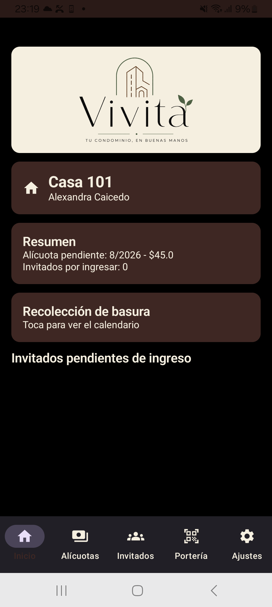
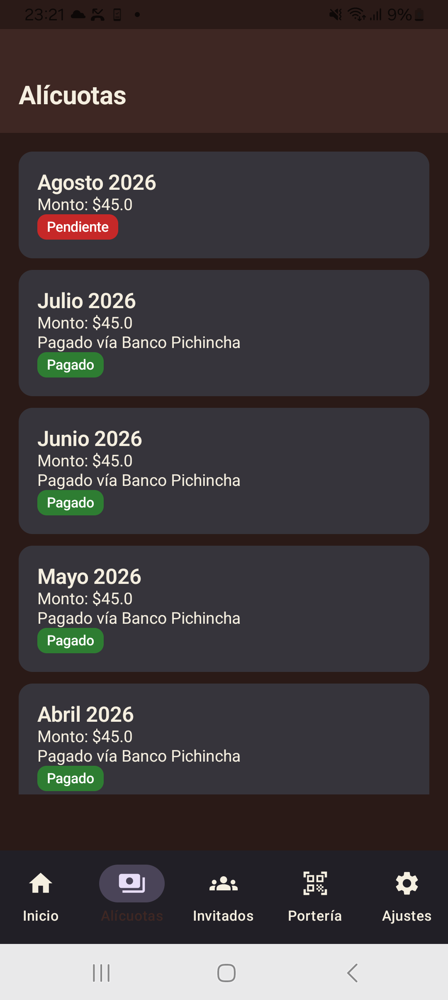
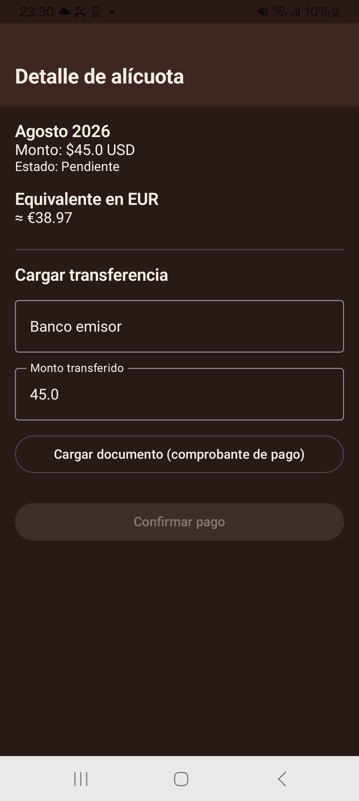
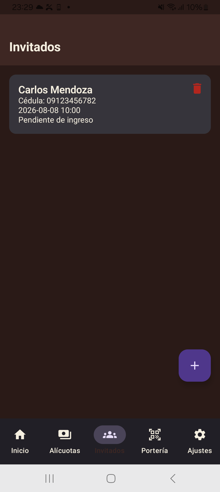
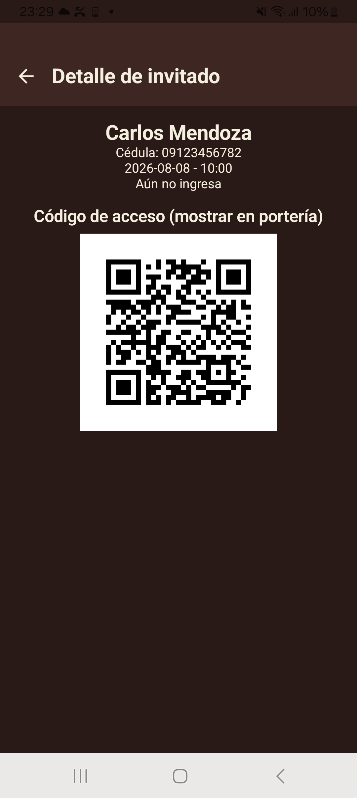
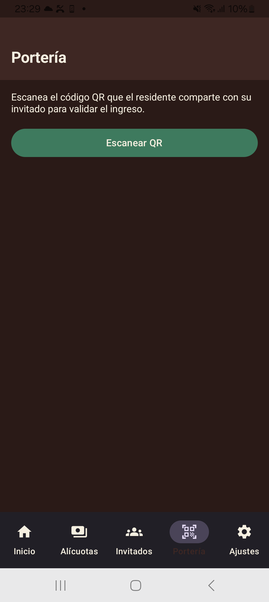
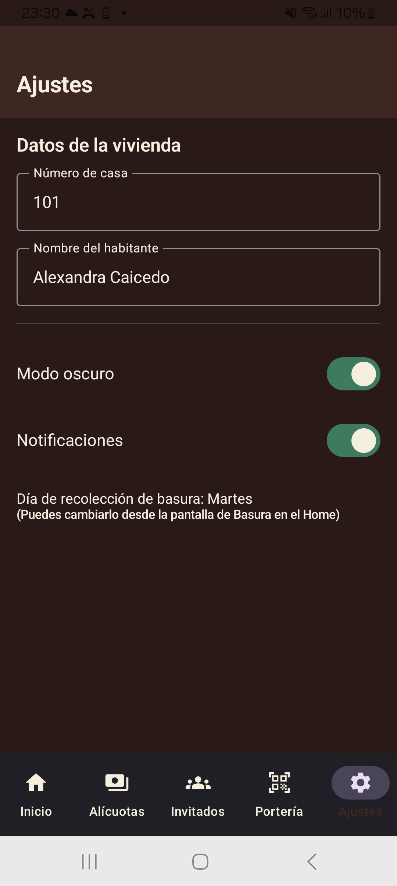
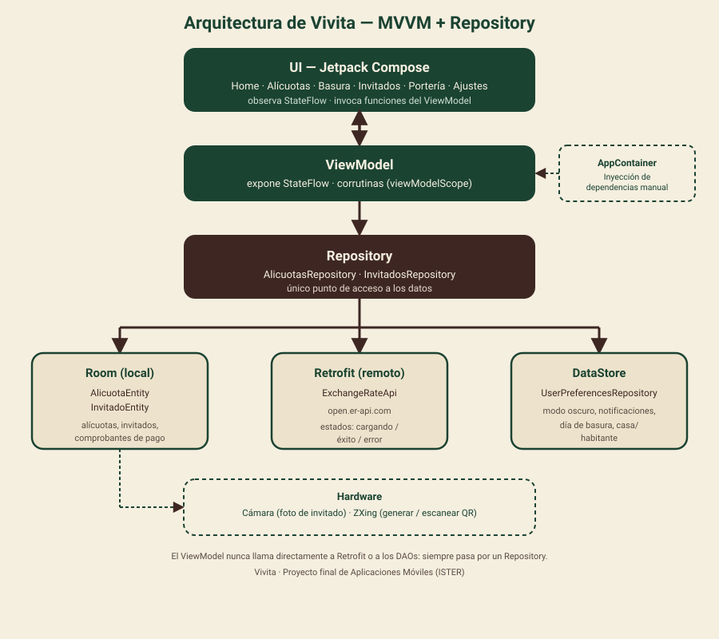

# Vivita

**Vivita** es una aplicación Android para la administración de conjuntos habitacionales. Permite a un residente controlar el pago de alícuotas, ver el calendario de recolección de basura, registrar invitados con código QR y validar su ingreso desde portería.

Proyecto final de la asignatura de Aplicaciones Móviles (ISTER).

## Capturas de pantalla

| Home | Alícuotas | Pago de alícuota |
|---|---|---|
|  |  |  |

| Invitados | Detalle de invitado (QR) | Portería |
|---|---|---|
|  |  |  |

| Ajustes |
|---|
|  |

## Funcionalidades

- **Home**: resumen de la vivienda (casa y habitante registrado), alícuota pendiente, invitados por ingresar y acceso al calendario de basura.
- **Alícuotas**: historial de pagos con estado (pagado/pendiente). Al pagar, se carga el banco emisor, el monto transferido y el comprobante (foto o PDF) de la transferencia. Muestra el equivalente en EUR consultando una API pública de tasas de cambio.
- **Basura**: calendario de recolección, día configurable y persistido.
- **Invitados**: registro de invitados con nombre, cédula y foto (cámara). Cada invitado recibe un código QR único para su ingreso, y puede eliminarse de la lista.
- **Portería**: escaneo del código QR del invitado para validar su ingreso.
- **Ajustes**: datos de la vivienda (casa/habitante), foto del conjunto cargada desde internet (Coil), modo oscuro, notificaciones y día de recolección de basura.

## Arquitectura

MVVM + Repository, con separación en capas:

```
ui/            Composables (pantallas) + ViewModels (StateFlow)
data/
  local/       Room (entidades, DAOs, AppDatabase) y DataStore (preferencias)
  remote/      Retrofit (API de tasa de cambio)
  repository/  Une Room + Retrofit + DataStore; único punto de acceso a datos
```

El ViewModel nunca llama directamente a Retrofit o a los DAOs: siempre pasa por un Repository. La inyección de dependencias es manual, a través de `AppContainer` (creado en la clase `Application`) y expuesto a los Composables con `appContainer()`.



## Stack técnico

- Kotlin 2.2.10 + Jetpack Compose (Material 3) + Navigation Compose
- Arquitectura MVVM + Repository, corrutinas y `StateFlow`
- **Room** (persistencia local): alícuotas e invitados
- **DataStore Preferences**: modo oscuro, notificaciones, día de basura, casa/habitante
- **Retrofit**: consumo de [open.er-api.com](https://open.er-api.com) (tasa de cambio USD → EUR), con manejo de estados de carga/éxito/error
- **CameraX / cámara del sistema + ZXing**: foto del invitado y generación/escaneo de código QR
- **Coil**: carga de imágenes desde internet (foto del conjunto en Ajustes) y desde archivos locales (fotos de invitados)
- AGP 9.2.1 · Gradle 9.4.1 · compileSdk 36 · minSdk 26

## Hardware y permisos

- **Cámara**: foto del invitado al registrarlo, y escaneo de QR en portería. Se solicita el permiso en tiempo de ejecución; si el usuario lo rechaza, se muestra un mensaje y se puede reintentar.

## Compilar y ejecutar

```bash
./gradlew assembleDebug      # APK de depuración
./gradlew bundleRelease      # .aab firmado (requiere keystore.properties, no versionado)
./gradlew assembleRelease    # .apk firmado
```

El proyecto usa el Gradle Wrapper incluido; solo se necesita el Android SDK instalado (`local.properties` con `sdk.dir` apuntando a él).

## Despliegue

El `.aab` firmado y el `.apk` de instalación directa se generan en:

```
app/build/outputs/bundle/release/app-release.aab
app/build/outputs/apk/release/app-release.apk
```

El keystore de firma no se incluye en el repositorio (buena práctica: nunca se sube a control de versiones).
